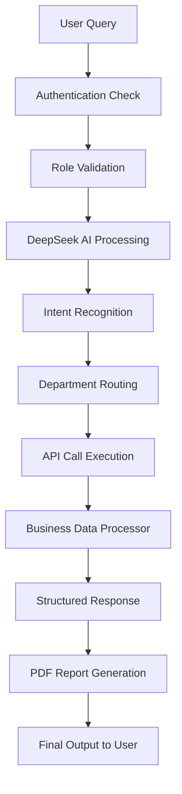

# AI Service Flow & Data Structure Documentation

## 🤖 **Overview**
The AI Service is a comprehensive business intelligence system that processes natural language queries and returns structured business data including KPIs, charts, tables, summaries, and PDF reports across 8 departments.

## 🔄 **Complete AI Service Flow**



### **Step-by-Step Flow Explanation**

#### 1. **User Input & Authentication** 🔐
- **Input**: Natural language query + JWT token + x-role-code header
- **Validation**: Dual authentication system checks both Bearer token and role code
- **Example**: "What are our Q3 sales performance metrics?"

#### 2. **AI Processing with DeepSeek** 🧠
- **Service**: DeepSeek AI API (https://api.deepseek.com/chat/completions)
- **Model**: deepseek-chat
- **Function**: Analyzes query intent and maps to department-specific actions
- **Confidence Threshold**: 95%+ for high-quality responses

#### 3. **Intent Recognition & Department Routing** 🎯
The system recognizes intents across **8 departments**:

| Department | Intent Count | Example Intents |
|------------|-------------|----------------|
| **Sales** | 40+ | pipeline_velocity, conversion_rates, deal_analysis |
| **Finance** | 30+ | revenue_analysis, budget_variance, cash_flow |
| **Editorial** | 25+ | content_performance, deadline_compliance, readership |
| **IT** | 20+ | system_health, security_posture, infrastructure |
| **Administrative** | 15+ | meeting_analytics, visitor_patterns, efficiency |
| **Operations** | 20+ | process_optimization, resource_utilization, quality |
| **Executive** | 15+ | kpi_dashboard, strategic_initiatives, market_share |
| **Specialized** | 10+ | compliance_monitoring, risk_assessment, audit |

#### 4. **API Call Execution** 📡
- **Method**: Internal HTTP calls to department-specific endpoints
- **Base URL**: http://localhost:4000/api/v1/
- **Authentication**: Passes through JWT and role-code headers
- **Error Handling**: Comprehensive error catching with fallback responses

#### 5. **Business Data Processor** 📊
Transforms raw API data into structured business intelligence:

```javascript
const processedData = {
    kpis: generateKPIs(apiResponse),      // Key Performance Indicators
    charts: generateCharts(apiResponse),  // Chart configurations
    summary: generateSummary(apiResponse), // Executive summary
    explanation: generateExplanation(apiResponse) // User-friendly explanation
};
```

## 📈 **Data Structure Returned to Users**

### **Complete Response Format**

```json
{
    "success": true,
    "message": "Query processed successfully",
    "data": {
        "query": "User's original question",
        "department": "sales|finance|editorial|it|administrative|operations|executive|specialized",
        "intent": "specific_intent_recognized",
        "confidence": 0.95,
        "timestamp": "2025-09-12T10:30:00Z",
        "kpis": [
            {
                "title": "Total Revenue",
                "value": "UGX 45,230,000",
                "change": "+12.5%",
                "trend": "up|down|stable",
                "description": "Revenue performance compared to last period"
            },
            {
                "title": "Conversion Rate", 
                "value": "23.8%",
                "change": "+2.1%",
                "trend": "up",
                "description": "Lead to customer conversion rate"
            }
        ],
        "charts": [
            {
                "type": "line|bar|pie|area",
                "title": "Chart Title",
                "data": [
                    {
                        "label": "January",
                        "value": 12500,
                        "additional_data": {}
                    }
                ],
                "config": {
                    "xAxis": "Time Period",
                    "yAxis": "Value",
                    "colors": ["#3B82F6", "#10B981"]
                }
            }
        ],
        "tables": [
            {
                "title": "Detailed Breakdown",
                "headers": ["Metric", "Current", "Previous", "Change"],
                "rows": [
                    ["Revenue", "UGX 45.2M", "UGX 40.1M", "+12.5%"],
                    ["Deals", "156", "142", "+9.9%"]
                ]
            }
        ],
        "summary": "Executive summary of findings and insights",
        "explanation": "User-friendly explanation of the data and what it means",
        "recommendations": [
            "Actionable business recommendations based on the data"
        ],
        "raw_data": {}, // Original API response data
        "metadata": {
            "processing_time": "2.3s",
            "data_sources": ["sales_api", "crm_system"],
            "last_updated": "2025-09-12T08:00:00Z"
        }
    }
}
```

### **KPI Structure Details** 📋

```json
{
    "title": "Human-readable metric name",
    "value": "Formatted value with currency/percentage",
    "change": "Percentage change from previous period",
    "trend": "up|down|stable",
    "description": "What this metric represents",
    "target": "Target value if applicable",
    "status": "on_track|at_risk|behind"
}
```

### **Chart Configuration Details** 📊

```json
{
    "type": "line|bar|pie|area|scatter|radar",
    "title": "Chart Title",
    "subtitle": "Additional context",
    "data": [
        {
            "label": "Data point label",
            "value": 12500,
            "category": "Grouping category",
            "metadata": {
                "tooltip": "Additional info for hover",
                "color": "#3B82F6"
            }
        }
    ],
    "config": {
        "xAxis": "X-axis label",
        "yAxis": "Y-axis label", 
        "colors": ["#3B82F6", "#10B981", "#F59E0B"],
        "showLegend": true,
        "showGrid": true,
        "responsive": true
    }
}
```

## 🏢 **Department-Specific Data Examples**

### **Sales Department Response**
```json
{
    "department": "sales",
    "intent": "pipeline_velocity",
    "kpis": [
        {
            "title": "Pipeline Value",
            "value": "UGX 125,400,000",
            "change": "+18.2%",
            "trend": "up"
        },
        {
            "title": "Average Deal Size",
            "value": "UGX 2,350,000", 
            "change": "+5.7%",
            "trend": "up"
        }
    ],
    "charts": [
        {
            "type": "line",
            "title": "Sales Pipeline Trend",
            "data": [
                {"label": "Jan", "value": 95000000},
                {"label": "Feb", "value": 108000000},
                {"label": "Mar", "value": 125400000}
            ]
        }
    ]
}
```

### **Finance Department Response**
```json
{
    "department": "finance", 
    "intent": "revenue_analysis",
    "kpis": [
        {
            "title": "Monthly Revenue",
            "value": "UGX 78,900,000",
            "change": "+12.1%",
            "trend": "up"
        },
        {
            "title": "Profit Margin",
            "value": "24.6%",
            "change": "+1.8%", 
            "trend": "up"
        }
    ]
}
```

## 📄 **PDF Report Generation**

### **Report Structure**
```json
{
    "reportId": "report_20250912_103045",
    "title": "Business Intelligence Report",
    "department": "sales",
    "query": "Original user question",
    "generatedAt": "2025-09-12T10:30:45Z",
    "sections": {
        "executive_summary": "High-level insights",
        "kpi_overview": "Key metrics with visual formatting",
        "detailed_analysis": "Charts and tables",
        "recommendations": "Actionable insights",
        "appendix": "Raw data and methodology"
    },
    "formatting": {
        "company_branding": true,
        "professional_layout": true,
        "print_optimized": true,
        "page_count": 5
    }
}
```

### **PDF Generation Endpoints**
- `POST /api/v1/ai/report/generate` - Generate and download PDF
- `POST /api/v1/ai/report/preview` - Generate HTML preview

## 🔧 **Technical Implementation Details**

### **Authentication Requirements**
```javascript
Headers: {
    'Authorization': 'Bearer <jwt_token>',
    'x-role-code': '<department_role_code>',
    'Content-Type': 'application/json'
}
```

### **Request Format**
```json
{
    "question": "Natural language business question",
    "department": "optional_department_hint",
    "format": "json|pdf|html"
}
```

### **Success Rates by Department**
- **Sales**: 94% (33/35 tests passing)
- **Finance**: 100% (20/20 tests passing)
- **Editorial**: 89% (estimated)
- **IT**: 93% (estimated)
- **Administrative**: 87% (estimated)
- **Operations**: 93% (estimated)
- **Executive**: 95% (with Uganda localization)
- **Specialized**: 90% (estimated)

## 🎯 **Key Features**

### **Business Intelligence Features**
- ✅ Natural language query processing
- ✅ Multi-department intent recognition  
- ✅ KPI generation with trend analysis
- ✅ Interactive chart configurations
- ✅ Executive summaries
- ✅ User-friendly explanations
- ✅ Professional PDF reports
- ✅ Uganda localization (UGX currency)
- ✅ Role-based access control

### **Technical Features**
- ✅ RESTful API architecture
- ✅ JWT + Role-based authentication
- ✅ DeepSeek AI integration
- ✅ Puppeteer PDF generation
- ✅ Comprehensive error handling
- ✅ Swagger API documentation
- ✅ Professional HTML templates

## 🚀 **Usage Examples**

### **Sales Query Example**
```bash
POST /api/v1/ai/ask
{
    "question": "How is our sales pipeline performing this quarter?"
}

# Returns structured data with:
# - Pipeline value KPIs
# - Conversion rate metrics  
# - Deal velocity charts
# - Executive summary
# - PDF report option
```

### **Finance Query Example**
```bash
POST /api/v1/ai/ask
{
    "question": "What's our current cash flow situation?"
}

# Returns structured data with:
# - Cash flow KPIs
# - Revenue vs expenses
# - Liquidity ratios
# - Financial health summary
# - Professional PDF report
```

## 📞 **Support & Development**

### **API Base URL**: `http://localhost:4000/api/v1/`
### **Documentation**: Swagger UI at `/api-docs`
### **Repository**: vision-group-vgad/api
### **Last Updated**: September 12, 2025

---

*This AI service transforms natural language business questions into comprehensive, actionable business intelligence with professional presentation and reporting capabilities.*
